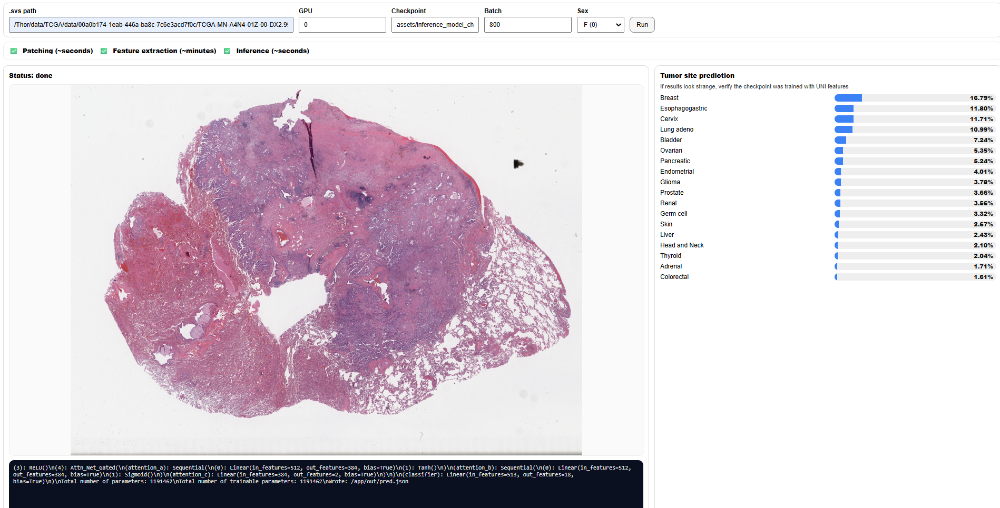

# TOAD-TCGA-Reproducibility

A fully reproducible evaluation of **Tumor Origin Assessment via Deep Learning (TOAD)** on **TCGA whole-slide images (WSI)**, with learning curves to study how performance scales as training data is reduced.

This repository provides:
- **Containerized preprocessing** (WSI patching + feature extraction)
- **Containerized training/evaluation** with a **learning-curve runner** (x% training data)
- A **local inference GUI** for running the TCGA-trained model on a slide and exporting JSON summaries

## Purpose

Deep learning models for cancer histopathology are increasingly used to classify the primary site of origin, yet many approaches are difficult to reproduce because trained models and/or training data are not fully accessible. Here, we provide a **TCGA-only** reproduction of TOAD and a systematic evaluation across data regimes (learning curves), including an encoder comparison between **ResNet-50** (pretrained with supervised learning on Imagenet) and **UNI** (a foundation model pretrained with self-supervised learning on histopathological images https://github.com/mahmoodlab/UNI).

---

## Model and feature availability

### Trained model weights
- ✅ **Publicly released weights (via Zenodo):** **ResNet-based TOAD trained model weights** (AGPL-3.0).
- ❌ **Not released:** **UNI-based TOAD trained model weights**, the encoder is distributed under terms that restrict redistribution, but is available here: https://github.com/mahmoodlab/UNI.

---

## Data: downloading TCGA slides (GDC)

Slides must be obtained from the **GDC portal** / **GDC Data Transfer Tool** using the **GDC file IDs** listed in:

- `src_preprocessing/CLAM_encoder/dataset_csv/TCGA.csv`

```

After download, point preprocessing to the folder containing the `.svs` files (or a folder tree that contains them).

---

## Artifacts (Zenodo)

Large artifacts are **not** stored in git. You will download them from Zenodo and place them at the expected paths.

**Containers**
- `assets/containers/singularity_preprocessing.simg`
- `assets/containers/singularity_train_eval.simg`

**Public trained model weights (ResNet-based)**
- `assets/inference_model_checkpoint/<your_model_file>.pt`

**Zenodo DOI:** https://doi.org/10.5281/zenodo.18535256

Recommended: verify integrity using `SHA256SUMS` from Zenodo:
```bash
sha256sum -c SHA256SUMS
```

---

## Quickstart

### 0) Choose a container runtime (Singularity vs Apptainer)

Some systems provide `singularity`, others provide `apptainer`. These tools are compatible for most usage, but the command name differs.

To make the scripts portable, they support a `RUNTIME` variable:
- If `RUNTIME` is not set, the script auto-detects `apptainer` first, then `singularity`.
- You can override it explicitly:
  ```bash
  RUNTIME=apptainer bash run_preprocessing.sh ...
  # or
  RUNTIME=singularity bash run_preprocessing.sh ...
  ```

### 1) Preprocessing (WSI → FEATURES)

This script searches for `.svs` under `--input-dir` up to `--maxdepth` and creates:
- `<out-root>/logs_and_metadata/` (per-slide logs + extracted metadata)
- `<out-root>/FEATURES/` (feature files)

**Default encoder:** `resnet50_trunc` 

```bash
bash run_preprocessing.sh   --input-dir /abs/path/to/svs_folder_or_tree   --out-root  /abs/path/to/preprocessing_output   --gpu 0
```

Useful options:
- `--encoder` uni_v1 or resnet50_trunc (To use UNI encoder follow the instructions: https://github.com/mahmoodlab/CLAM?tab=readme-ov-file#using-conch--uni-as-pretrained-encoder)
- `--jobs` parallel slides on the same GPU
- `--batch-size` feature extraction batch size (default 800)
- `--target-patch-size` patch size (default 224)
- `--maxdepth` search depth (default 2)
- `--image` preprocessing container path (default `assets/containers/singularity_preprocessing.simg`)
- `--code` preprocessing code path (default `src_preprocessing/CLAM_encoder`)

### 2) Training & evaluation (FEATURES → learning curves)

Runs training and evaluation for multiple training-data fractions (configured in `run_train_eval.sh`) and writes results under:
- `train_eval_output/RESULTS_EXP_*/`

```bash
bash run_train_eval.sh   --features /abs/path/to/preprocessing_output/FEATURES   --gpu 0
```

> **Important:** the encoder used for feature extraction must match what you train/evaluate on.
> - UNI features → train/eval a UNI-feature model (not distributed)
> - ResNet features → train/eval a ResNet-feature model (public weights distributed)

### 3) Inference GUI (local)



Launch the GUI (default port 8765):
```bash
bash run_inference_GUI.sh
```

Change port:
```bash
PORT=9000 bash run_inference_GUI.sh
```

The GUI writes outputs under:
- `output/inference_GUI_runs/<timestamp>/...`

To locate where the GUI expects the trained model weights path:
```bash
rg -n "weights|model|\.pt|checkpoint" src_inference_GUI/*.py
```

---

## Repository structure (high level)

- `run_preprocessing.sh` — containerized preprocessing
- `run_train_eval.sh` — containerized learning-curve training/eval
- `run_inference_GUI.sh` — run local GUI
- `src_preprocessing/CLAM_encoder/` — preprocessing subset (derived from CLAM)
- `src_train_eval/` — train/eval code (derived from TOAD + modifications)
- `src_inference_GUI/` — local GUI + inference logic
- `assets/containers/` — container build recipes (Dockerfiles)
- `LICENSE`, `NOTICE`, `THIRD_PARTY_NOTICES.md`, `licenses/` — licensing + attribution
- `CITATION.cff`, `DATA_AVAILABILITY.md`, `CHANGES.md` — paper-support files

---

## Licensing & attribution (summary)

- **Repository license:** GNU **AGPL-3.0** (see `LICENSE`).
- Derived components (summary):
  - **TOAD (AGPL-3.0):** basis for training/evaluation; modified for primary-site only, learning curves, patient-level stratification defaults, extra logging, and containerized execution support.
  - **CLAM (GPL-3.0):** subset used for WSI patching and feature extraction (classifier training scripts excluded).
- See `THIRD_PARTY_NOTICES.md` and `licenses/` for full details.

### Model weights license
- Public **ResNet-based** trained TOAD weights are released under **AGPL-3.0**.
- UNI-based trained weights are not distributed (see https://github.com/mahmoodlab/UNI).

---

## Citation

See `CITATION.cff`. Please also cite the associated paper and the Zenodo record (DOI) once available.
